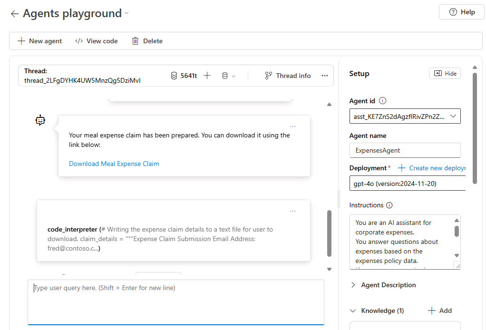

---
lab:
  title: AI 에이전트 개발 살펴보기
  description: Azure AI 파운드리 포털에서 Azure AI 에이전트 서비스를 살펴보고 AI 에이전트 개발의 첫 번째 단계를 수행합니다.
---

# AI 에이전트 개발 살펴보기

이 연습에서는 Azure AI 파운드리 포털의 Azure AI 에이전트 서비스를 사용하여 직원의 비용 청구를 지원하는 간단한 AI 에이전트를 만듭니다.

이 연습에는 약 **30**분이 소요됩니다.

> **참고**: 이 연습에 사용된 일부 기술은 미리 보기이거나 현재 개발 중에 있습니다. 예기치 않은 동작, 경고 또는 오류가 발생할 수 있습니다.

## Azure AI 파운드리 프로젝트 만들기

먼저 Azure AI 파운드리 프로젝트를 만들어 보겠습니다.

1. 웹 브라우저에서 [Azure AI 파운드리 포털](https://ai.azure.com)(`https://ai.azure.com`)을 열고 Azure 자격 증명을 사용하여 로그인합니다. 처음 로그인할 때 열리는 팁이나 빠른 시작 창을 닫고, 필요한 경우 왼쪽 위에 있는 **Azure AI 파운드리** 로고를 사용하여 다음 이미지와 유사한 홈페이지로 이동합니다(**도움말** 창이 열려 있는 경우 닫습니다).

    

1. 홈페이지에서 **+ 프로젝트 만들기**를 선택합니다.
1. **프로젝트 만들기** 마법사에서 유효한 프로젝트 이름을 입력하고 기존 허브가 추천되면 새 허브를 만드는 옵션을 선택합니다. 그런 다음 허브 및 프로젝트를 지원하기 위해 자동으로 만들어지는 Azure 리소스를 검토합니다.
1. **사용자 지정**을 선택하고 허브에 대해 다음 설정을 지정합니다.
    - **허브 이름**: *허브에서 유효한 이름*
    - **구독**: ‘Azure 구독’
    - **리소스 그룹**: ‘리소스 그룹 만들기 또는 선택’
    - **위치**: 다음 지역 중 하나를 선택합니다.\*
        - eastus
        - eastus2
        - 스웨덴 중부
        - westus
        - westus3
    - **Azure AI 서비스 또는 Azure OpenAI 연결**: *새 AI 서비스 리소스 만들기*
    - **Azure AI 검색 연결**: 연결 건너뛰기

    > \* 작성 시 이러한 지역은 에이전트에서 사용할 gpt-4o 모델을 지원합니다. 모델 가용성은 지역 할당량에 의해 제한됩니다. 연습 후반부에 할당량 한도에 도달하는 경우 다른 지역에서 다른 프로젝트를 만들어야 할 수도 있습니다.

1. **다음**을 선택하여 구성을 검토합니다. **만들기**를 선택하고 프로세스가 완료될 때까지 기다립니다.
1. 프로젝트를 만들 때 표시되는 팁을 모두 닫고 Azure AI 파운드리 포털에서 프로젝트 페이지를 검토합니다. 이 페이지는 다음 이미지와 유사합니다.

    

## 생성형 AI 모델 배포

이제 에이전트를 지원하기 위해 생성형 AI 언어 모델을 배포할 준비가 되었습니다.

1. 프로젝트 왼쪽 창의 **내 자산** 섹션에서 **모델 + 엔드포인트** 페이지를 선택합니다.
1. **모델 + 엔드포인트** 페이지의 **모델 배포** 탭의 **+ 모델 배포** 메뉴에서 **기본 모델 배포**를 선택합니다.
1. 목록에서 **gpt-4o** 모델을 검색하고 선택한 후 확인합니다.
1. 배포 세부 정보에서 **사용자 지정**을 선택하여 다음 설정으로 모델을 배포합니다.
    - **배포 이름**: *모델 배포에 대한 유효한 이름*
    - **배포 유형**: 글로벌 표준
    - **자동 버전 업데이트**: 사용
    - **모델 버전**: *사용 가능한 최신 버전 선택*
    - **연결된 AI 리소스**: *Azure OpenAI 리소스 연결 선택*
    - **분당 토큰 속도 제한(천 단위)**: 50K *(또는 50K 이하인 경우 구독에서 사용 가능한 최대치)*
    - **콘텐츠 필터**: DefaultV2

    > **참고**: TPM을 줄이면 사용 중인 구독에서 사용 가능한 할당량을 과도하게 사용하지 않을 수 있습니다. 이 연습에 사용되는 데이터는 50,000TPM이면 충분합니다. 사용 가능한 할당량이 이 수치 이하이면 연습을 완료할 수 있지만 속도 제한을 초과하는 경우 기다린 다음 프롬프트를 다시 제출해야 할 수 있습니다.

1. 배포가 완료될 때가지 기다립니다.

## AI 에이전트 만들기

이제 모델을 배포했으므로 AI 에이전트를 빌드할 준비가 되었습니다. 이 연습에서는 기업의 경비 정책을 기반으로 질문에 대답하는 간단한 에이전트를 빌드합니다. 경비 정책 문서를 다운로드하고 이를 에이전트에 대한 *기반* 데이터로 사용합니다.

1. 새 브라우저 탭을 열고 [Expenses_policy.docx](https://raw.githubusercontent.com/MicrosoftLearning/mslearn-ai-agents/main/Labfiles/01-agent-fundamentals/Expenses_Policy.docx)를 다운로드하여 `https://raw.githubusercontent.com/MicrosoftLearning/mslearn-ai-agents/main/Labfiles/01-agent-fundamentals/Expenses_Policy.docx`로컬에 저장합니다. 이 문서에는 가상의 Contoso 회사에 대한 경비 정책의 세부 정보가 포함되어 있습니다.
1. Azure AI 파운드리 포털이 있는 브라우저 탭으로 돌아가서 왼쪽 탐색 창의 **빌드 및 사용자 지정** 섹션에서 **에이전트** 페이지를 선택합니다.
1. 메시지가 표시되면 Azure OpenAI 서비스 리소스를 선택하고 이동합니다.

    *Agent123*과 같은 이름의 새 에이전트가 자동으로 생성되어야 합니다(그렇지 않은 경우에는 **+ 새 에이전트** 버튼을 사용하여 생성합니다).

1. 새 에이전트를 선택합니다. 그런 다음 새 에이전트의 **설정** 창에서 **에이전트 이름**을 `ExpensesAgent`(으)로 설정하고 이전에 만든 gpt-4o 모델 배포가 선택되어 있는지 확인한 다음 **지침**을 다음과 같이 설정합니다.

    ```prompt
   You are an AI assistant for corporate expenses.
   You answer questions about expenses based on the expenses policy data.
   If a user wants to submit an expense claim, you get their email address, a description of the claim, and the amount to be claimed and write the claim details to a text file that the user can download.
    ```

    

1. **설정** 창을 아래로 내려 **지식** 머리글 옆에 있는 **+추가**를 선택합니다. 그런 다음 **지식 추가** 대화 상자에서 **파일**을 선택합니다.
1. **파일 추가** 대화 상자에서 `Expenses_Vector_Store`(이)라는 이름의 새로운 벡터 저장소를 생성하고, 이전에 다운로드한 **Expenses_policy.docx** 로컬 파일을 업로드하여 저장합니다.

    

1. **설정** 창의 **지식** 섹션에서 **Expenses_Vector_Store**가 목록으로 나오고 있고 1개의 파일이 포함되어 있는지 확인합니다.

1. **지식** 섹션 아래의 **작업** 옆의 **+ 추가**를 선택합니다. 그런 다음 **작업 추가** 대화 상자에서 **코드 인터프리터**를 선택한 다음 **저장**을 선택합니다(코드 인터프리터용 파일을 업로드할 필요는 없습니다).

    에이전트는 사용자가 에이전트의 지식 소스로 업로드한 문서에 *기반을 두고* 응답합니다(즉, 이 문서의 내용에 따라 질문에 답변합니다). 에이전트는 작업을 수행하는 데 필요한 경우 자체 Python 코드를 생성하고 실행하여 코드 인터프리터 도구를 사용합니다.

## 에이전트를 테스트합니다.

이제 에이전트를 만들었으므로 Azure AI 파운드리 포털 플레이그라운드에서 테스트할 수 있습니다.

1. 에이전트에 대한 **설정** 창의 맨 위에서 **플레이그라운드에서 사용해 보기**를 선택합니다.
1. 플레이그라운드에서 `What's the maximum I can claim for meals?` 프롬프트를 입력하고 에이전트의 응답을 검토합니다. 이 응답은 에이전트 설정에 지식으로 추가한 경비 정책 문서에 있는 정보를 기반으로 해야 합니다.

    > **참고**: 속도 제한을 초과하여 에이전트가 응답하지 못하는 경우. 몇 초 정도 기다렸다가 다시 시도하세요. 구독에서 사용할 수 있는 할당량이 부족한 경우 모델이 응답하지 않을 수 있습니다.

1. 후속 프롬프트 `I'd like to submit a claim for a meal.` 사용 후 응답을 검토합니다. 에이전트가 사용자에게 청구를 제출하는 데 필요한 정보를 요청해야 합니다.
1. 에이전트에게 이메일 주소를 제출합니다(예: `fred@contoso.com`). 에이전트는 응답을 확인하고 비용 청구에 필요한 나머지 정보(설명 및 금액)를 요청해야 합니다.
1. 청구 및 금액을 설명하는 프롬프트를 제출합니다(예: `Breakfast cost me $20`).
1. 에이전트는 코드 인터프리터를 사용하여 비용 청구 텍스트 파일을 준비하고, 사용자가 파일을 다운로드할 수 있는 링크를 제공해야 합니다.

    

1. 텍스트 문서를 다운로드하고 열어 비용 청구 세부 정보를 확인합니다.

## 정리

연습을 마쳤으므로 불필요한 리소스 사용을 방지하기 위해 만든 클라우드 리소스를 삭제해야 합니다.

1. [Azure Portal](https://portal.azure.com)을 `https://portal.azure.com`에서 열고 이 연습에서 사용한 허브 리소스를 배포한 리소스 그룹의 내용을 확인합니다.
1. 도구 모음에서 **리소스 그룹 삭제**를 선택합니다.
1. 리소스 그룹 이름을 입력하고 삭제할 것인지 확인합니다.
